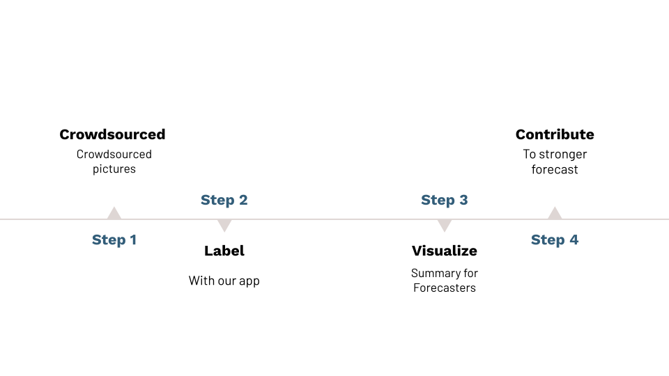

# AvalancheGuard
 
Avalanche forecasts save lives. They help people who travel, live, work, and recreate in the backcountry to make informed decisions about their activities in snowy mountain environments. 

We are focusing on the field observation data, complementing the weather and snowpack data that forecasters use to determine avalanche danger levels. We are solving the problems of the limited number of field observations, the quality of field observations, and the precious time spent extracting the most relevant information.

## How Does it Work 

## How to Contribute