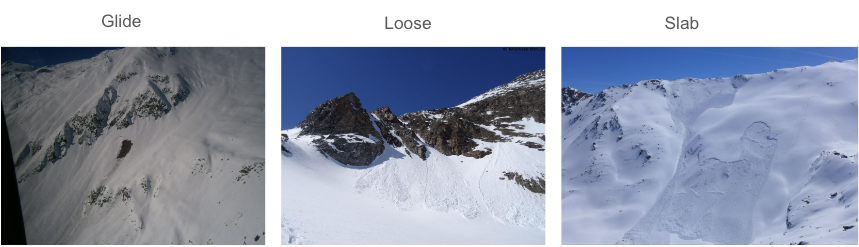
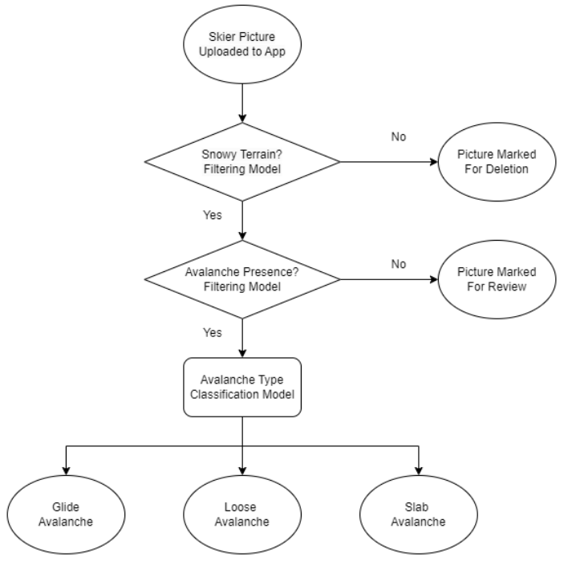
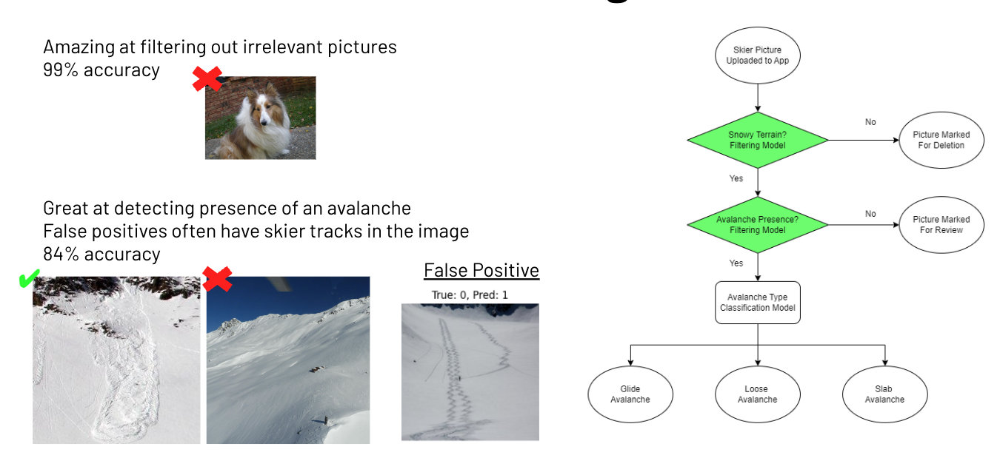
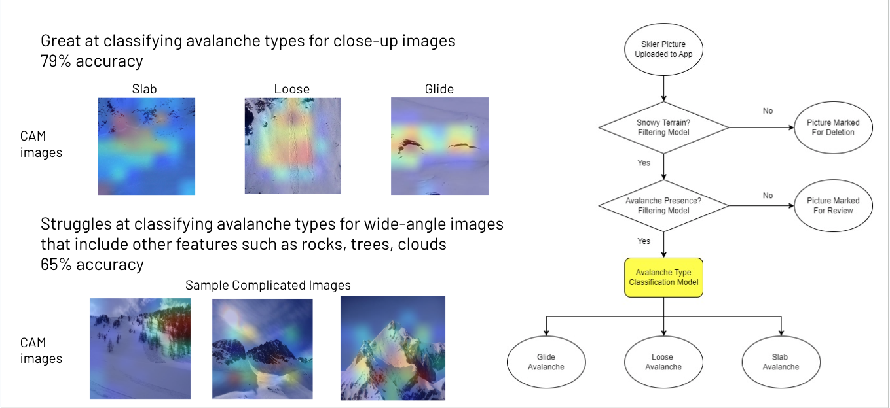
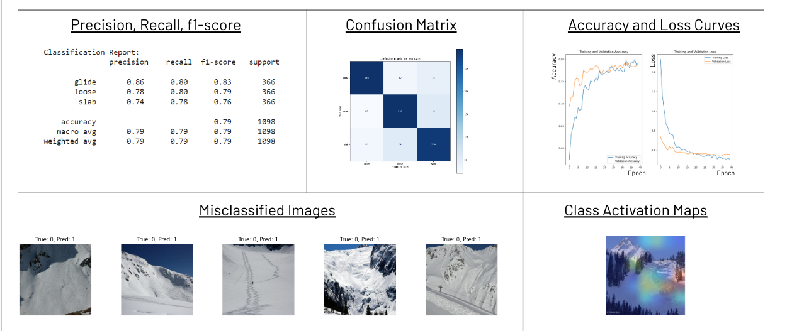
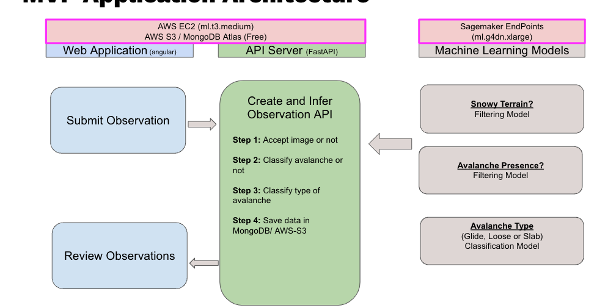
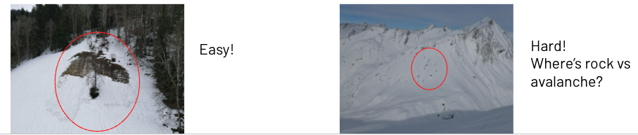

# Our Solution

We are focusing on the field observation data, complementing the weather and snowpack data that forecasters use to determine avalanche danger levels. We are solving the problems of the limited number of field observations, the quality of field observations, and the precious time spent extracting the most relevant information.

## Dataset

Our dataset, published by Fox et al. from the University of Innsbruck in Austria, provides a robust foundation for avalanche detection research. It comprises 4,095 labeled avalanche images, categorized by type (Glide, Loose, Slab) or marked as No Avalanche. The accompanying paper, dataset, and code are available on GitHub at github.com/j-f-ox/avalanche-detection. This dataset is instrumental in training and validating our models to ensure accurate and reliable avalanche detection.

### Types of Avalanches
- **Glide**: Slow-moving slides along the ground, often characterized by a visible glide crack.
- **Loose**: Areas where loose, unconsolidated snow is sliding down the slope, typically starting at a point and fanning out.
- **Slab**: Large, cohesive slabs of snow that have broken away, seen as a distinct, clean break in the snowpack.

## Data Pre-Processing

To prepare the data for analysis, we perform several pre-processing steps to enhance the quality and relevance of the data.

## Preprocessing Steps

To enhance the accuracy and reliability of our avalanche image dataset, we implemented several preprocessing steps:

- Crop close-up of avalanches from original wide-angle pictures. 
- Resize all images to 224x224, maintaining consistency w/ many computer vision foundation 
- models.
Balance Classes, undersampling the majority class.

# Models

## Model Architecture
Three Cascaded Models successively take an input picture uploaded by a snow enthusiast and first filter out any pictures that are not a snowy mountain. Second, Filter out any pictures 
that don’t feature an avalanche. Third, Classify a valid picture of an avalanche 
into an avalanche type: glide, loose, or slab. 

## Overview

Our solution involves a multi-stage pipeline with three models, each designed for specific tasks in the process of avalanche detection and classification. All 3 models are fine-tuned on EfficientNetV2S. Differences in task complexity and nature (binary vs multi-class) drive differences in fine-tuning layers and parameters.

We landed on EfficientNetV2S fine-tuning, leveraging a common image classification transfer learning approach for our moderate dataset size. 
Feature extraction of colors and texture was insufficient due to image complexity 
Transformer-based approaches are state-of-the-art but difficult b/c of our small dataset
Cleaning data, preprocessing, class balancing, fine-tuning layer params were also all tuned

## Filtering Models

## Classification Model

## Model Evaluation

Models were evaluated using a combination of metrics and analysis tools.
Accuracy was used for model training because the type of misclassification is not important. 

## Aplication Architecture

## Key Learnings

- **Snow is complex!** Models that work well on objects that are colorful or have clear boundaries or textures don’t work as well on snow. Avalanche paths don’t have clear boundaries. They can look similar to lighting variations or other types of disturbed snow like skier tracks. Patches of dirt, rock, groups of trees can also all look very similar so that the patch of dirt that gets detected w/ a glide avalanche can easily cause false positives in pictures of rocky mountains. 
- Cascaded Models are modular, future-proof, reduce complexity, improve explainability. The architecture will allow us to add filtering models or a segmentation model for example in the future. 
- Feature extraction, CNN-based, and Transformer-based models all have different advantages. CNN based EfficientNet finetuning ended up working well for our use case b/c of complexity & dataset size.

## Key Contributions

- **Avalanche Detection**: With AvalancheGuard, we are able to automatically detect three types of snow avalanches.

- **EfficientNetV2S Model for Avalanche Detection**: With AvalancheGuard, we explored EfficientNetV2S, an architecture not currently explored for avalanche detection.

- **Detection Application for Crowdsourced Images**: With AvalancheGuard, we provide the community with a ready-to-use, easy, and fast application for avalanche detection.

## Future Work

- Enhancing the reach of our model by including a segmentation model capable of recognizing avalanches from far distances. Inclusing the exploration of, for example, interactive segmentation. 

- Improving the accuracy of our detection using crowdsourced images. This will enable us to cover more regions around the world.

